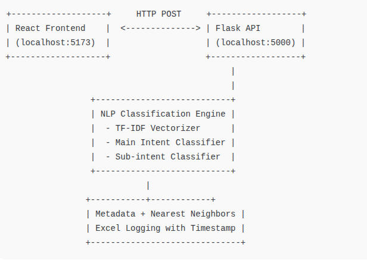
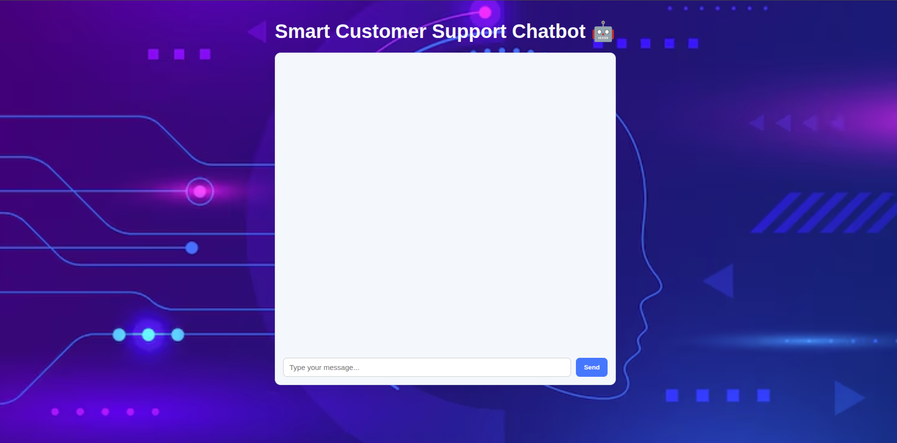
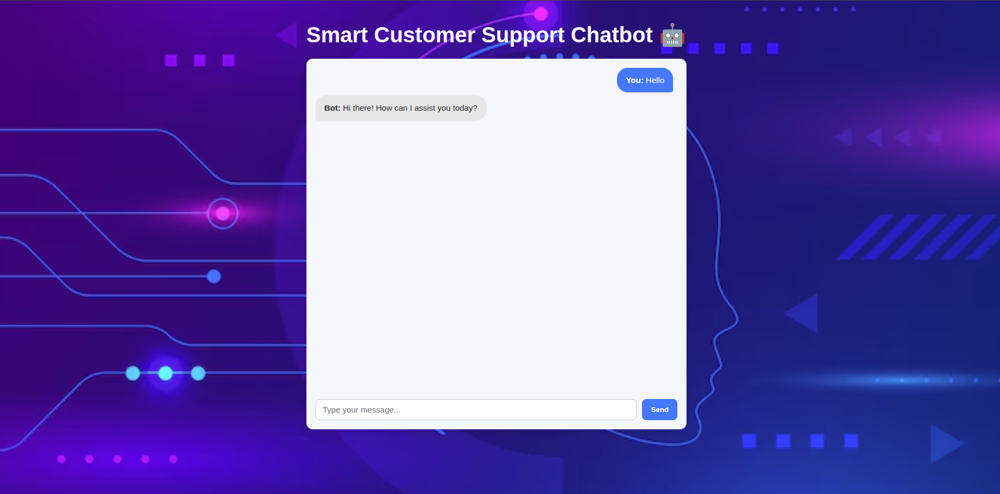
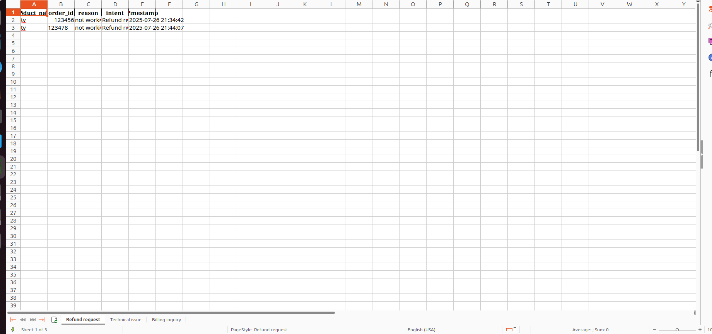

# 🧠 NLP Chatbot – Customer Support System

## 📖 Overview

This chatbot provides automated responses for common customer service queries such as **refund requests**, **technical issues**, **billing inquiries**, and **product information**. It uses **Natural Language Understanding (NLU)** to predict intent and collect relevant information (slots). If the bot cannot resolve the issue, it **escalates the conversation** to human support.



---

## ⚙️ Backend Getting Started

### 1. Setup Environment

#### ✅ Prerequisites:
- Python 3.8+
- pip

#### 💾 Installation:
```bash
pip install -r requirements.txt
```

# Developer Notes

## Running the App
To start the backend server, run:

```bash
python app.py
```

The Flask server will start at: http://127.0.0.1:5000

# Project-Backend Structure 

```
Model backend
    │
    ├── app.py               # Main Flask app (chatbot backend)
    ├── original.py          # Core logic of SupportChatbot
    ├── utils.py             # Slot filling, intent prediction, preprocessing
    ├── model/               # Pretrained model files
    ├── data/                # Any Excel, CSV or .json data sources
    ├── templates/           # HTML frontend (if any)
    ├── requirements.txt     # Project dependencies
```

## 🤖 Chatbot Capabilities

### 🎯 Supported Intents & Expected Slots

| Intent                       | Expected Slots                                  |
|-----------------------------|--------------------------------------------------|
| Refund request              | `product_name`, `order_id`, `reason`            |
| Technical issue             | `product_name`, `order_id`, `issue_description` |
| Billing inquiry             | `order_id`                                       |
| Cancellation request        | `order_id`                                       |
| Product inquiry             | `product_name`, `order_id`                       |
| Product inquiry → Warranty  | `product_name`, `order_id`                       |
| Product inquiry → Availability | `product_name`, `order_id`                   |
| Product inquiry → Specification | `product_name`, `order_id`                  |

---

### 🧠 Keyword Mapping (Auto Intent Detection)

| Intent               | Keywords Tracked                                                   |
|----------------------|--------------------------------------------------------------------|
| Refund request       | `"refund"`, `"return"`, `"money back"`, `"not happy"`              |
| Technical issue      | `"broken"`, `"not working"`, `"error"`, `"problem"`, `"defect"`, `"malfunction"` |
| Billing inquiry      | `"bill"`, `"charged"`, `"payment"`, `"invoice"`, `"amount"`        |
| Cancellation request | `"cancel"`, `"stop order"`, `"terminate"`, `"abort"`               |
| Product inquiry      | `"warranty"`, `"available"`, `"specification"`, `"details"`, `"color"`, `"stock"` |

---

## ⚙️ How It Works

### 1. Greeting Handling

- If the user greets (e.g., “hi”, “hello”), bot replies:
  > _"Hi there! How can I assist you today?"_
- No intent detection is triggered at this point.

---

### 2. Intent Prediction

- The bot processes the user message using:
  - A **BERT-like model**
  - Or a **keyword matcher**
- It then identifies the **intent** and moves to **slot collection**.

---

### 3. Slot Collection

- The bot checks for required slots based on the intent.
- It sequentially asks for missing slots from the user.
- All information is stored in a session dictionary like:

```python
self.session = {
    "intent": "Refund request",
    "slots": {
        "product_name": "Headphones",
        "order_id": "12345"
    },
    "state": "collecting"
}
```

### 4. Confidence Threshold & Fallback

- If prediction confidence is **low**, a **fallback strategy** is triggered.
- If uncertainty continues even after fallback, the bot **escalates to human support**.

#### 🔁 Escalation Message:
> _"Sorry, I couldn't understand. Escalating to human support."_

---

### 💬 Sample Interaction

```text
User: Hello  
Bot: Hi there! How can I assist you today?

User: I want a refund for my headphones  
Bot: Sure, may I know the Order ID?

User: OD12345  
Bot: Please share the reason for refund.

User: The product was damaged.  
Bot: Thanks. Your refund request for 'headphones' (Order ID: OD12345) has been logged.
```

## 📥 Input Data Sources

- **Excel/CSV files** are used for:
  - Customer lookup
  - Order verification  
  - Loaded using `openpyxl` or `pandas`

- **Intent Classifier Model**:
  - Trained using either:
    - 🤗 `transformers` (e.g., BERT-based models)
    - OR `scikit-learn` models (e.g., Logistic Regression, Naive Bayes)

---

## ❗ Error Handling

| Error Type                     | Description / Resolution                                                                 |
|-------------------------------|-------------------------------------------------------------------------------------------|
| `ModuleNotFoundError`         | Ensure all dependencies are installed using: `pip install -r requirements.txt`            |
| Incomplete Slot Collection     | Bot will continue prompting the user until all required slots are provided                |
| API/Flask Server Errors        | Check the `app.py` console logs or use debugging tools to trace issues in backend logic   |

## 🖥️ Frontend Getting Started

### 🚀 Steps to Run the Frontend

1. **Unzip** the frontend code folder.
2. Open a terminal in that folder and run the following commands:

```bash
npm i
npm run dev
```

3. Once the server starts, open your browser and go to:
```
http://localhost:5173/
```

4. Make sure the backend (app.py) is running in another terminal before accessing the frontend.

- How First Page look like:


- Response from the ChatBot


## ✅ Final Step

Once the frontend and backend are running:

- The chatbot will be fully functional.
- You can begin testing conversations from the browser.

---

## 🗂️ Data Logging (Backend)

- The backend will **store all user interactions** and support details inside:

```bash
backend/support_logs.xlsx
```

### 📊 support_logs.xlsx Structure

- The `support_logs.xlsx` file contains **separate sheets** for each type of customer issue:
  - `Refund Request`
  - `Technical Issue`
  - `Billing Inquiry`
  - `Cancellation Request`
  - `Product Inquiry` (and its subtypes)

---

### 📁 Each Sheet Includes:

- 🕒 **Date & Time** of interaction  
- 🎯 **Intent Type**  
- 🔍 **Slot Values**  
  - e.g., `product_name`, `order_id`, `reason`, etc.
- 💬 **User Messages and Bot Responses** (if implemented)

> ✅ This structured logging is useful for reviewing support history, generating analytics, and improving future chatbot performance.

- How your stored data look like:


